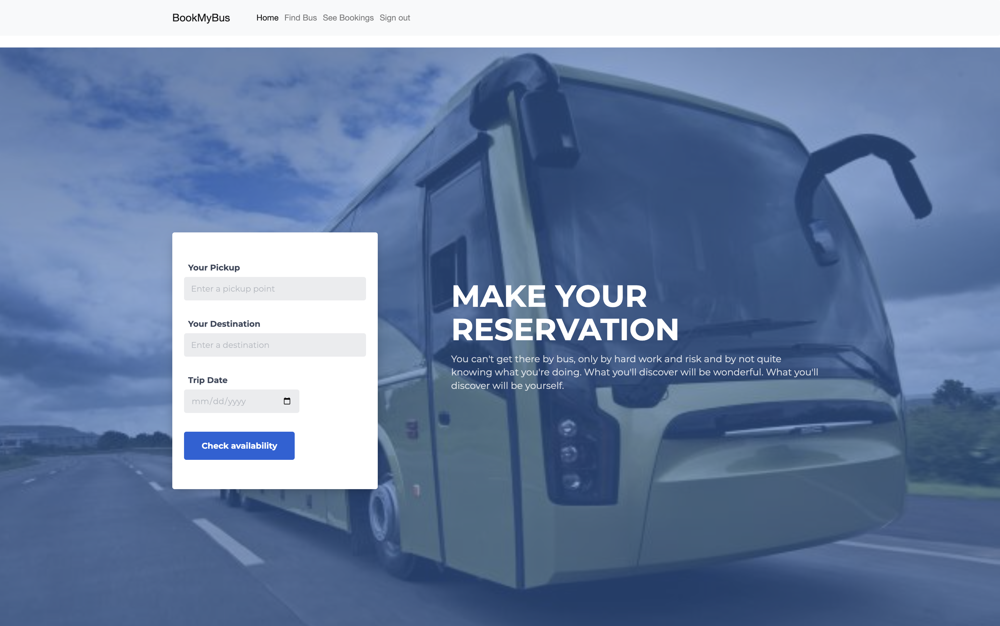

# BookMyBus

## Overview
**BookMyBus** is a Django-based online bus ticket booking system designed to simplify the process of booking bus tickets. It offers a user-friendly interface for travelers to search, book, and manage tickets and provides an admin panel for bus operators to manage schedules and bookings.

---


## Features
### User Features:
- **Search Buses:** Search for buses by origin, destination, and date.
- **Seat Selection:** View available seats and select preferred ones.
- **Booking Confirmation:** Receive booking confirmation details.
- **Booking History:** Manage past bookings and cancellations.

### Admin Features:
- **Bus Management:** Add, update, and delete bus schedules.
- **Booking Overview:** Track user bookings and generate reports.

---

## Technologies Used
- **Backend:** Django (Python)
- **Frontend:** HTML, CSS, JavaScript
- **Database:** SQLite
- **Static Files:** Managed via Django's static file system
- **Templates:** Django templates for dynamic HTML rendering

---

## Directory Structure
- **myproject/**: Root directory of the Django project.
  - **myapp/**: Core application folder containing:
    - `models.py`: Database models
    - `views.py`: Request handling and business logic
    - `forms.py`: Form validations
    - `templates/myapp/`: HTML templates for rendering UI
  - **static/mysite/**: Static files like CSS, JavaScript, and images
  - **db.sqlite3**: SQLite database file
  - **manage.py**: Command-line utility for administrative tasks

---

## How to Run the Project
### Prerequisites:
1. Python 3.8 or later installed on your system.
2. Install Django and other required dependencies.

### Steps:
1. **Clone the Repository:**
   ```bash
   git clone git@github.com:varana2001/BookMyBus.git
   cd BookMyBus
   ```

2. **Create and Activate Virtual Environment:**
   ```bash
   python -m venv venv
   source venv/bin/activate  # On Windows use `venv\Scripts\activate`
   ```

3. **Install Dependencies:**
   ```bash
   pip install -r requirements.txt
   ```

4. **Apply Migrations:**
   ```bash
   python manage.py migrate
   ```

5. **Create a Superuser (Admin Access):**
   ```bash
   python manage.py createsuperuser
   ```
   Follow the prompts to create an admin user.

6. **Run the Development Server:**
   ```bash
   python manage.py runserver
   ```

7. **Access the Application:**
   - User Interface: [http://127.0.0.1:8000/](http://127.0.0.1:8000/)
   - Admin Panel: [http://127.0.0.1:8000/admin/](http://127.0.0.1:8000/admin/)

---

## Usage
1. **User Flow:**
   - Register or log in.
   - Search for buses based on origin, destination, and date.
   - Select an available bus and choose preferred seats.
   - Confirm the booking and receive a booking confirmation.
   - Manage bookings from the user dashboard.

2. **Admin Flow:**
   - Log in to the admin panel.
   - Add or modify bus schedules.
   - Track and manage bookings.

---

## Future Enhancements
- **Payment Gateway Integration:** Allow users to pay online for ticket bookings.
- **Live Seat Availability:** Real-time seat availability tracking.
- **Mobile App:** Develop an Android/iOS app for easier access.
- **Multi-Language Support:** Support multiple languages for better accessibility.

---

## Contributing
We welcome contributions! To contribute:
1. Fork the repository.
2. Create a new branch (`feature-branch`).
3. Commit your changes.
4. Push to the branch and submit a pull request.

---

## License
This project is licensed under the MIT License. See the [LICENSE](LICENSE) file for details.

---

## Contact
For any queries, feel free to reach out:
- **GitHub:** [varana2001](https://github.com/varana2001)
- **Email:** varana2001@example.com
